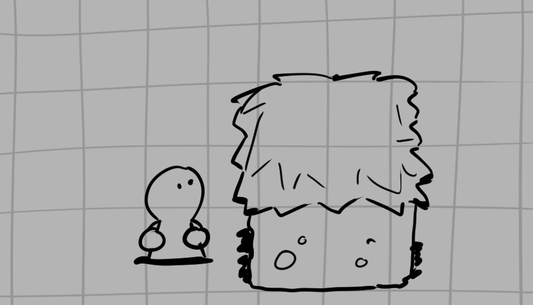
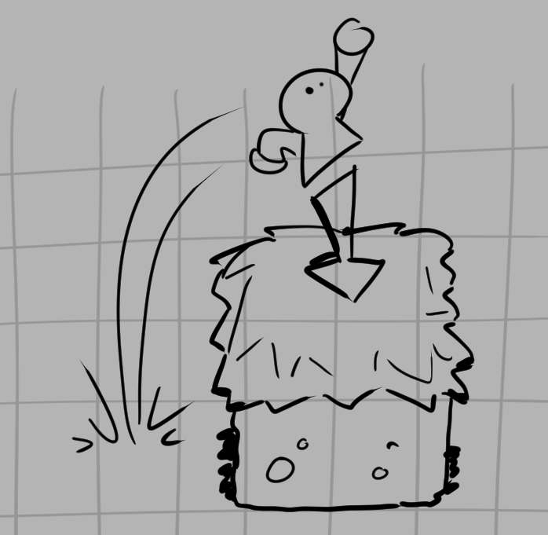
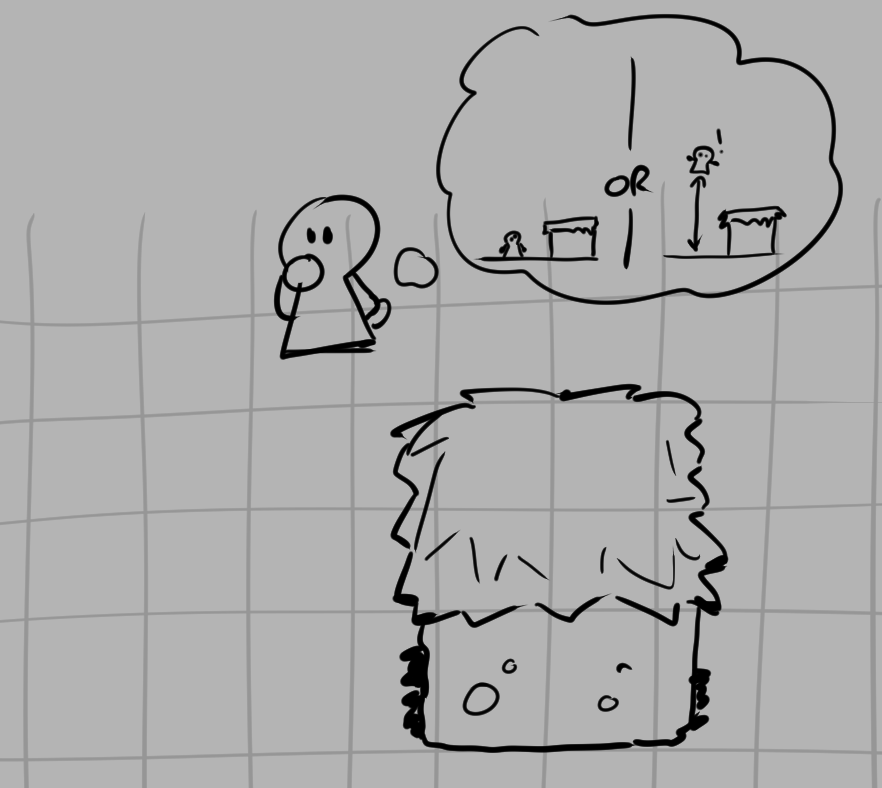
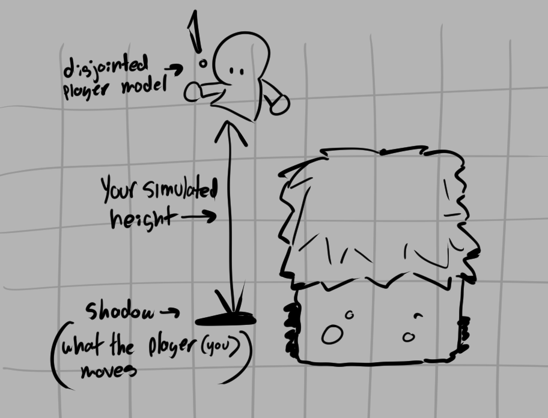
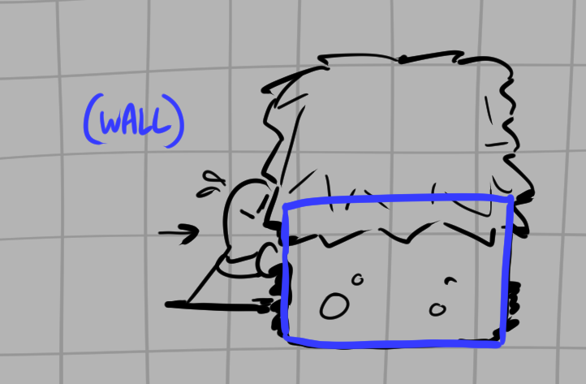
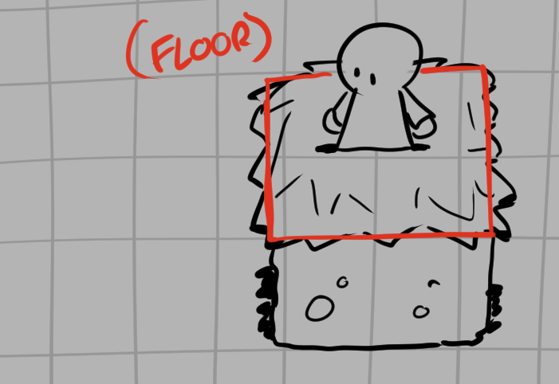

# Breaking Down The Problem

Unity being the flexible engine it is, it can function both as a 3D engine and as a 2D one. A number of concessions must be made depending on whichever one you pick. With 3D games, assets and eviroments generally require more work to both function properly and look appealing, while 2D games lend themselves more towards certain genres that indie devs find easier to develop for.

But just because a project is 2D doesn't mean the third axis has to be completely thrown out, we can simulate our very own Z axis through the use of some clever coding, a specialized character object, and responsive colliders.

## What *is* Up?

Say we have a simple player object standing next to a raised platform. 

Obviously we can't just walk up onto the platform, so it can remain solid for now. However if we jump up above that platform, it should allow us to step up onto that platform.

That's great, but in our current context *our platform does not know if we jumped up to it, or simply had a higher Y value*. Remember, our game is from a top down perspective, just like a *Final Fantasy* RPG or *The Legend of Zelda*. The game engine does not inherintly know when we're truly "above" a platform.

We can remedy this by splitting our character object into two distinct objects, a `grounded shadow` object, and a `playermodel` child object. Now when we jump, our *true* height can be expressed by the distance between the playermodel and the grounded object.

So to summarize: we should only be able to jump onto the platform if this simulated height is high enough.

## What is a Wall, and What is a Floor?

Great! So now we know that our player should be a shadow that tracks along the ground with a jumping playermodel on top. But what about platforms? Sometimes they're a wall and sometimes they're a floor.

It helps to think about how you'd mount a raised platform in real life. If you just try walking into the platform what happens? Well obviously it's a solid object that you can't pass through, you need to *gain the height* needed to go up and onto it. Once you're on top of the object *your current height* is great enough that the walls no longer effect you, but there is the danger of falling off. But as long as you're on *the new floor* you've found yourself on, you won't fall. When you decide to get off you *leave that floor* and drop down to your previous height, and that *floor* is now a *wall*.

This seems awfully long winded but it's necesary to break down any sort of coding problem like this. Remember, Unity isn't going to do all of this for you, there's no magical "make platform" button that's going to know the exact context and function you want it to have. *You* have to put it in context.

## Edge Cases That Will Cause Headaches Later

A few questions to keep in mind before we move onto actually coding and assembling our game objects:

- How will we handle multi tiered platforms?

- What happens when we try to jump onto more than one platform? Which one should we land on, and should we even be able to land on them?

- What happens when we leave one platform and land on another?

These will all come up later in the collision guide, and it's important to keep in mind edge cases or weird subversions on what can come up later. I've personally had to redo the collision system and character movement a number of times in response to new bugs found when leaving or entering platforms in a certain way, and there's always some new fun bug just around the corner.

But we should not fear bugs, a known bug is the best kind because knowing what's going wrong and where is 80% of the problem. We will designate the workload of the platform system into regimented segments that makes locating bugs a breeze.